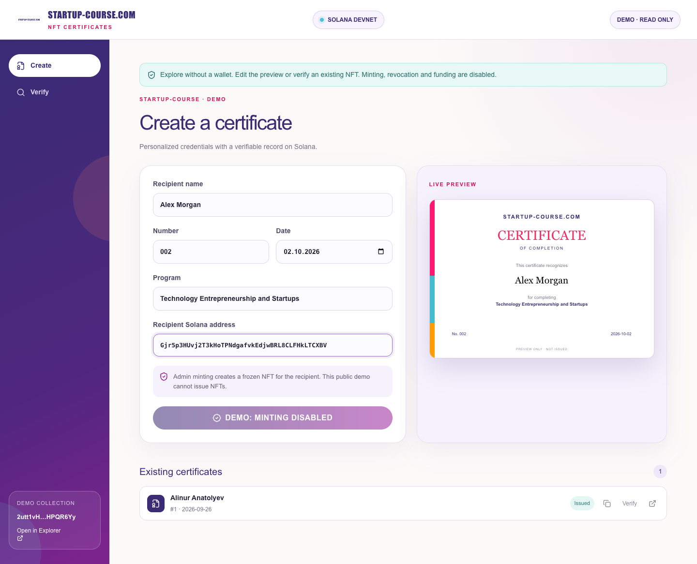
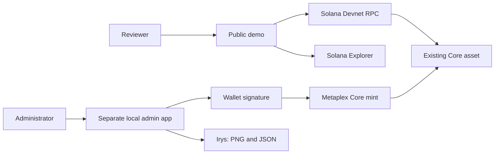

# NFT Certificates

> Educational certificates with a publicly verifiable record on Solana.

[Live Demo](https://nft-certificates-startupcourse.vercel.app/) · [Presentation](https://canva.link/fi4o90opx2lcwoj) · [Pitch Video](https://youtu.be/NKXJ4DrLMzY) · [Video Demo · 3 min](docs/NFT-Certificates-Demo-3min.mp4) · [Judge Guide](docs/JUDGE-GUIDE.md)



## Colosseum submission

NFT Certificates is a Solana Devnet MVP for course organizers, accelerators and graduates. This repository contains the application, administrator issuance workflow, public verification interface, tests and demo video.

| Team member | Role | Contact |
| --- | --- | --- |
| Alinur | Project creator and developer | [GitHub @alishkka](https://github.com/alishkka) |

Team captain and submission contact: [@thenotoriouskentik on Telegram](https://t.me/thenotoriouskentik).

Development assistance: OpenAI Codex and ChatGPT. Generic UI components and hosting utilities remain from the starter template.

## Problem and solution

**Certificate provenance.** A PDF can display a name and logo without proving who issued it. The prototype associates a certificate with a Metaplex Core asset, its owner and its collection.

**Manual verification.** Reviewers may need to contact the organizer to confirm a document. The verifier reads the asset from Solana Devnet and provides an independent Explorer link.

**Sharing a credential.** A graduate can share the NFT address so a reviewer can inspect the same public record. Connecting a wallet is not required for verification.

The blockchain record alone does not establish a person's identity, course completion or institutional accreditation. Issuer onboarding remains planned work.

## Public demo

The judging deployment is **read-only**. Visitors can edit the preview and verify the existing NFT. Certificate issuance and management are administrator functions and are disabled in the public build. Visitors cannot mint, revoke or modify existing certificates.

**Live application:** https://nft-certificates-startupcourse.vercel.app/

### Try it in one minute

1. Open the public demo, then edit the recipient name, date or program.
2. Check the live certificate preview.
3. Scroll to **Existing certificates** and click **Verify** on certificate #1.
4. Inspect its owner and collection, then open Solana Explorer.

Only a confirmed existing asset appears in the demo. Form edits do not create certificates.

## Why Solana

- **Metaplex Core:** the application uses an existing asset standard for ownership, collection membership and plugins.
- **Public verification:** the client reads the asset through Solana RPC, and reviewers can cross-check it in Explorer.
- **Wallet integration:** administrator code integrates MetaMask Solana Connect and Phantom for signing.
- **Devnet:** the MVP uses test SOL while issuance and storage integrations are evaluated.

No custom Solana program is deployed by this project.

## Summary of features

| Feature | Current status |
| --- | --- |
| English certificate form and live preview | Available in public demo |
| Existing NFT owner and collection lookup | Live Solana Devnet read |
| Independent verification | Solana Explorer link |
| Administrator wallet integration | Implemented in separate local admin mode |
| PNG/JSON upload and Core minting | Implemented; fresh end-to-end wallet validation pending |
| Transfer restriction | Mint code uses Core PermanentFreezeDelegate |
| Revocation | Local browser flag only; no on-chain revocation |
| Verified issuer registry | Planned |

## Tech stack

| Layer | Technology |
| --- | --- |
| Interface | React 19, TypeScript, Tailwind CSS |
| Public demo | Vite static build, Vercel configuration |
| Local administrator app | Vinext/Vite |
| Solana client | Solana Web3.js, Metaplex Core, Umi |
| Storage integration | Irys |
| Wallets | MetaMask Solana Connect, Phantom |
| Testing | Node.js test runner; browser verification |
| AI development tools | OpenAI Codex, ChatGPT |

## Architecture



The public build disables write actions at build time. A client flag is not an issuer authentication system; on-chain updates still require the relevant signing authority. See [architecture and trust boundaries](docs/ARCHITECTURE.md).

## Quick start

Requirements: Node.js **22.13+**, **npm 11.12.1** and network access for Devnet reads.

```sh
git clone https://github.com/alishkka/NFT-Certificates-StartupCourse.git
cd NFT-Certificates-StartupCourse
npx --yes npm@11.12.1 ci
npm run dev
```

Open `http://localhost:5173/`. The default local session is a read-only demo. No API key, private key or environment file is required.

### Run checks

```sh
npm test
npm run lint
npx vite build --config vite.vercel.config.ts
```

The four regression tests cover browser byte handling, hashing and signer adaptation. They do not prove that a live upload or mint succeeds.

### Separate administrator session

```sh
NFTSTART_DEMO_MODE=admin npm run dev
```

Restart the server when switching modes. Connect the issuer wallet, acquire Devnet SOL, fill out a certificate and review wallet prompts. The collection update authority must match the issuer. The public Vercel configuration always builds read-only mode, regardless of this local variable.

### Deploy on Vercel

Import this GitHub repository into Vercel. The included `vercel.json` selects the Vite preset, npm version, static build command and `dist-vercel` output directory. No secrets are required for the public demo.

The original `npm run build` targets the earlier Cloudflare/Vinext setup. Use the Vercel-specific command above for this deployment.

## Existing on-chain example

| Field | Value |
| --- | --- |
| Network | Solana Devnet |
| Asset | `FxRV2Y2fbJzfeMcQgGHjd8SwLoXX2xfHAvudrqofxufQ` |
| Collection | `2utt1vHx3KHL2b45Rswt563ZriTM9aYD4QQihHPQR6Yy` |
| Owner | `Gjr5p3HUvj2T3kHoTPNdgafvkEdjwBRL8CLFHkLTCXBV` |
| Explorer name | KBTU Certificate #1 |
| Issued | 26 September 2026 |

Inspected on Devnet on 2 October 2026. This legacy asset has no usable metadata URI, so a wallet may not display its image. Devnet can reset.

## Roadmap

- [x] English interactive certificate preview
- [x] Public verification of an existing Devnet asset
- [x] Read-only judging demo and three-minute English video
- [ ] Validate a fresh wallet-to-storage-to-mint run
- [ ] Add issuer onboarding and indexed issuance history
- [ ] Implement independently verifiable revocation
- [ ] Test supported wallet rendering
- [ ] Run a course-provider pilot before evaluating mainnet

See the [full roadmap](docs/ROADMAP.md). Organizer subscriptions and per-certificate pricing are business hypotheses; demand and pricing have not been validated.

## Resources

- [Live application on Vercel](https://nft-certificates-startupcourse.vercel.app/)
- [Project presentation](https://canva.link/fi4o90opx2lcwoj)
- [Pitch video](https://youtu.be/NKXJ4DrLMzY)
- [Three-minute English demo](docs/NFT-Certificates-Demo-3min.mp4)
- [Judge testing guide](docs/JUDGE-GUIDE.md)
- [Architecture](docs/ARCHITECTURE.md)
- [Roadmap](docs/ROADMAP.md)
- [Contributing](CONTRIBUTING.md)

The demo video includes actual UI captures and a live lookup. Uploading, wallet signing and new issuance appear as explicitly labelled process diagrams.

## Repository structure

```text
app/                     Application, certificate workflow and styles
lib/                     Demo asset data and browser compatibility helpers
pages/main.tsx           Static demo entry point
public/                  Certificate artwork and favicon
tests/                   Browser/signing regression tests
docs/                    Video, screenshots, architecture and judge guide
vite.vercel.config.ts    Vercel static build configuration
vercel.json              Vercel install/build/output settings
```

## Limitations and attribution

This is a Devnet prototype. Admin history and revocation flags use localStorage. An issuer registry, production authentication and archival storage guarantees are not implemented. Wallet NFT rendering is not guaranteed. Obtain consent before publishing personal certificate data.

The supplied KBTU/Startup-Course artwork is prototype material. No institutional partnership or permission for unrelated reuse is claimed. Existing NFT data remains unchanged.

## License

No project-wide open-source license has been selected. Third-party dependencies, starter code and supplied artwork retain their respective licenses and rights.
